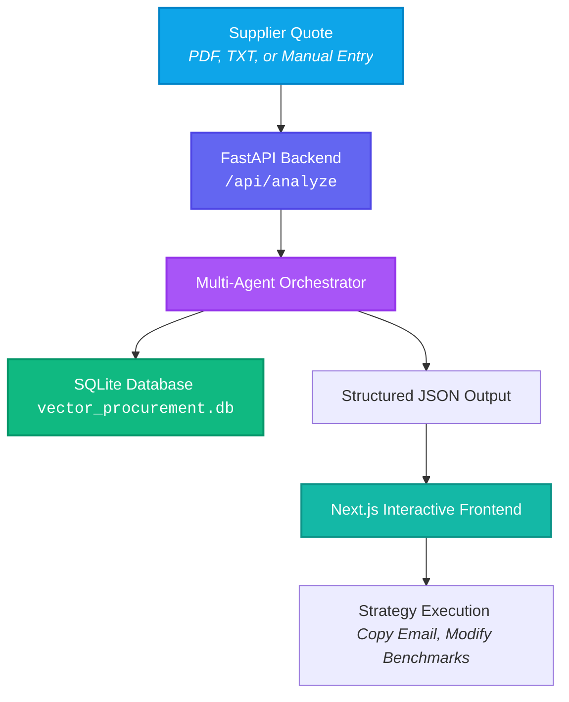
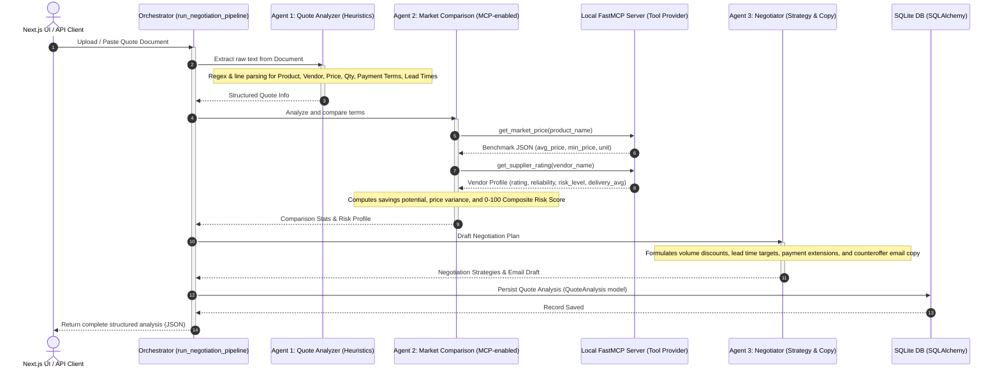

# 🛡️ VECTOR: AI Procurement Negotiation Assistant

VECTOR is an intelligent, offline-capable procurement negotiation assistant designed to analyze supplier quotes, cross-reference market averages, assess supplier risk, and dynamically generate tailored negotiation strategies and counteroffer emails. 

By leveraging a multi-agent system powered by FastMCP (Model Context Protocol), VECTOR automates the tedious parts of vendor negotiations, helping companies achieve cost optimization and mitigate supply chain risk.

---

## 🏗️ Architecture & Workflow

### System Workflow


### Multi-Agent Pipeline Diagram


---

## 🤖 The Multi-Agent Pipeline

VECTOR runs a sequential, three-agent offline collaboration workflow:

1. **Agent 1: Quote Analyzer Agent**
   - Automatically parses PDFs (using `pypdf`) or unstructured text.
   - Extracts crucial fields such as `product_name`, `vendor_name`, total `price`, `quantity`, `payment_terms`, and `delivery_time`.
   - Uses fuzzy keyword matching linked to the market database to classify items correctly even when supplier names or descriptions vary.

2. **Agent 2: Market Comparison Agent (MCP-Powered)**
   - Communicates dynamically with a local **FastMCP Server** (`mcp_server.py`) using Model Context Protocol over Standard I/O.
   - Resolves pricing benchmarks and historical vendor performance metrics.
   - Computes a composite **Risk Score (0–100)** incorporating rating penalties, suspicious pricing offsets, payment terms liability, and lead-time bottlenecks.

3. **Agent 3: Negotiation Agent**
   - Calculates a mathematically optimized target counteroffer price based on market minimums and volume sizes.
   - Identifies leverage points (e.g., payment term adjustments, lead-time guarantees).
   - Generates a polished, professional email draft ready to send back to the vendor's sales team.

---

## 🛠️ Technology Stack

| Layer | Technology | Key Features / Purpose |
| :--- | :--- | :--- |
| **Backend Core** | **FastAPI** | Async REST APIs, CORS compliance, fast request routing. |
| **Database** | **SQLAlchemy / SQLite** | Relational mapping, structured storage, transactional safety. |
| **Agent Server** | **FastMCP (Python)** | Exposes `get_market_price` and `get_supplier_rating` tools via standard protocols. |
| **Frontend Core** | **Next.js 14+ (App Router)** | Static rendering, client-side routing, modular layouts. |
| **Styling & UI** | **Tailwind CSS & Lucide Icons** | Utility-first responsive design, modern dark-mode aesthetic. |
| **Animations** | **Framer Motion** | Glassmorphism transitions, micro-animations, reactive tabs. |

---

## 📂 Project Structure

```
vector/
├── backend/
│   ├── __pycache__/
│   ├── agents.py           # Multi-agent logic (Analyzer, Comparison, Negotiator)
│   ├── benchmarks.json     # Local database for market prices and vendor scores
│   ├── database.py         # SQLAlchemy engine, QuoteAnalysis model, SQLite connection
│   ├── main.py             # FastAPI App router, CORS settings, file parsing
│   ├── mcp_client.py       # Handles stdio connection to launch & run mcp_server.py
│   ├── mcp_server.py       # FastMCP Server registering pricing/vendor rating tools
│   ├── requirements.txt    # Python dependencies (FastAPI, FastMCP, pypdf, sqlalchemy)
│   └── test_agents.py      # Standalone unit test script for local pipelines
├── frontend/
│   ├── public/             # Static graphics and icons
│   ├── src/
│   │   ├── app/
│   │   │   ├── dashboard/  # Analysis breakdown, graphs, copy templates
│   │   │   ├── home/       # Drag-and-drop file upload, manual entry presets
│   │   │   ├── settings/   # Benchmark edit portal
│   │   │   ├── globals.css # Styling imports
│   │   │   ├── layout.tsx  # Layout shell, navbar, and providers
│   │   │   └── page.tsx    # Immersive welcome page
│   │   ├── components/     # Navbar, charts, and card widgets
│   │   └── context/        # VectorContext holding frontend API states
│   ├── package.json        # Frontend Node dependencies (framer-motion, lucide-react)
│   └── tsconfig.json       # TypeScript configuration
├── Dockerfile              # Combines Python slim & Node.js environments for packaging
├── start.sh                # Script executing FastAPI & Next.js production builds side-by-side
├── .gitignore              # Ignores venv, database, node_modules, and environment credentials
└── .env.example            # Environment port/host binding mappings
```

---

## ⚡ Setup & Installation

### Option 1: Quick Start with Docker (Recommended)
You can run the entire application containerized. The Dockerfile compiles the Next.js frontend, installs backend modules, and manages processes using `start.sh`.

1. **Build the image**:
   ```bash
   docker build -t vector-app .
   ```
2. **Run the container**:
   ```bash
   docker run -p 3000:3000 -p 8000:8000 vector-app
   ```
3. Open `http://localhost:3000` in your web browser.

---

### Option 2: Local Development Setup

#### Backend Setup
1. Navigate to the `backend` directory and set up a virtual environment:
   ```bash
   cd backend
   python -m venv venv
   # On Windows:
   .\venv\Scripts\activate
   # On macOS/Linux:
   source venv/bin/activate
   ```
2. Install python dependencies:
   ```bash
   pip install -r requirements.txt
   ```
3. Start the backend development server:
   ```bash
   python main.py
   ```
   *The server will run at `http://localhost:8000`.*

#### Frontend Setup
1. Navigate to the `frontend` directory:
   ```bash
   cd ../frontend
   ```
2. Install npm dependencies:
   ```bash
   npm install
   ```
3. Run the Next.js development server:
   ```bash
   npm run dev
   ```
   *The client will run at `http://localhost:3000`.*

---

## 💡 System Operations Guide

### How FastMCP Tools Work
When a quote is processed, the backend client launches the FastMCP server (`mcp_server.py`) as a subprocess via standard input/output streams. The client queries two specific tools:
1. `get_market_price(product_name)`: Returns average, minimum, and maximum prices for the matching category in `benchmarks.json`.
2. `get_supplier_rating(vendor_name)`: Matches the supplier to their product category to fetch ratings out of 100, risk classes, and expected lead times.

### Customizing Benchmarks
You can customize the base benchmarks in real time. 
- **Method A**: Use the built-in **Settings** tab in the Next.js UI to edit baseline market prices and supplier ratings.
- **Method B**: Manually edit the `backend/benchmarks.json` file. It structure is as follows:
  ```json
  {
    "Stainless Steel Pipes": {
      "market_price": 1950.0,
      "supplier_rating": 72
    },
    "Plastic Granules": {
      "market_price": 118.0,
      "supplier_rating": 89
    }
  }
  ```
  The FastMCP server reload benchmarks dynamically on every API invocation.
